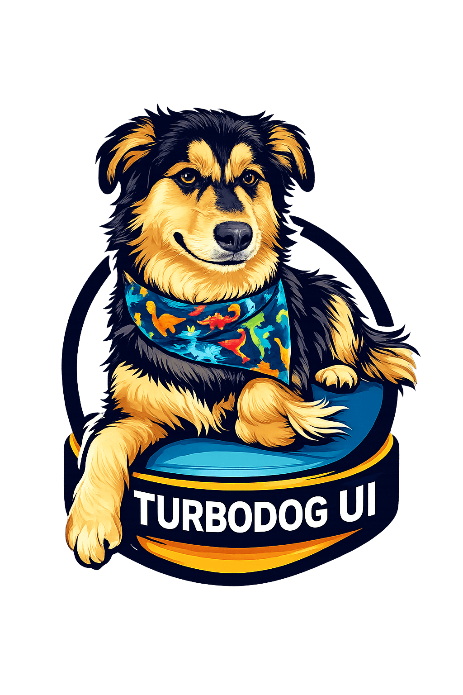

# Turbodog UI

<p align="center">
  
</p>

<p align="center">
  <a href="https://turbodogui.com" target="_blank" rel="noopener noreferrer">View it in action https://turbodogui.com</a>
</p>

A lightweight TypeScript UI library built with Web Components, a tiny router, CSS variable theming, a shared Fetch helper, and a responsive grid system.

## Features

- Native Web Components with TypeScript
- Lightweight router with dynamic route params
- Light and dark theme support with CSS variables and localStorage persistence
- Shared Fetch API wrapper for reusable API modules
- Responsive 12-column grid with breakpoint utilities
- Minimal external dependencies

## Getting started

```bash
npm install
npm run dev
```

## Components

### `<ui-card>`

A styled surface for grouping content.

```html
<ui-card>
  <h2>Title</h2>
  <p>Content goes here.</p>
</ui-card>
```

---

### `<ui-button>`

A styled button supporting variants and states.

```html
<ui-button type="button" variant="success">Click Me</ui-button>
<ui-button type="submit" disabled>Submit</ui-button>
```

| Attribute  | Type    | Values                          | Default    |
|------------|---------|---------------------------------|------------|
| `type`     | string  | `button`, `submit`, `reset`     | `button`   |
| `variant`  | string  | `success`, `warning`, `alert`   | primary    |
| `label`    | string  | any                             | —          |
| `disabled` | boolean | —                               | —          |

---

### `<ui-text-input>`

A styled input field with label, validation states, and accessibility support.

```html
<ui-text-input
  type="email"
  label="Email Address"
  placeholder="name@example.com"
  required
  error
></ui-text-input>
```

| Attribute     | Type    | Values            | Default      |
|---------------|---------|-------------------|--------------|
| `type`        | string  | any HTML input type | `text`     |
| `label`       | string  | any               | —            |
| `placeholder` | string  | any               | `Enter text` |
| `value`       | string  | any               | `""`         |
| `name`        | string  | any               | `""`         |
| `required`    | boolean | —                 | —            |
| `disabled`    | boolean | —                 | —            |
| `error`       | boolean | —                 | —            |

---

### `<ui-select>`

A styled select dropdown supporting option groups, multiple selection, and accessibility.

```html
<ui-select label="Favorite Fruit" name="fruit" value="orange">
  <option value="apple">Apple</option>
  <option value="orange">Orange</option>
  <optgroup label="Berries">
    <option value="strawberry">Strawberry</option>
  </optgroup>
</ui-select>
```

| Attribute  | Type    | Default |
|------------|---------|---------|
| `label`    | string  | —       |
| `name`     | string  | —       |
| `value`    | string  | —       |
| `required` | boolean | —       |
| `disabled` | boolean | —       |
| `multiple` | boolean | —       |

**Events:** `change` — `detail: { value: string }`

**Methods:** `value` getter/setter

---

### `<ui-tabs>`

A tabbed content container with keyboard navigation.

```html
<ui-tabs labels="Overview | Details | Settings" default-tab="0">
  <div slot="tab-0"><p>Overview content</p></div>
  <div slot="tab-1"><p>Details content</p></div>
  <div slot="tab-2"><p>Settings content</p></div>
</ui-tabs>
```

| Attribute     | Type   | Default |
|---------------|--------|---------|
| `labels`      | string | —       |
| `default-tab` | number | `0`     |

Labels are pipe-separated: `"Tab 1 | Tab 2 | Tab 3"`.

**Events:** `tab-changed` — `detail: { activeIndex: number }`

**Slots:** `tab-0`, `tab-1`, `tab-2`, etc.

---

### `<ui-accordion>`

Expandable content sections with optional multi-open support and keyboard navigation.

```html
<ui-accordion
  items="3"
  item-0-title="Section One"
  item-1-title="Section Two"
  item-2-title="Section Three"
  allow-multiple
>
  <div slot="item-0"><p>First section content</p></div>
  <div slot="item-1"><p>Second section content</p></div>
  <div slot="item-2"><p>Third section content</p></div>
</ui-accordion>
```

| Attribute        | Type    | Default |
|------------------|---------|---------|
| `items`          | number  | —       |
| `item-{n}-title` | string  | —       |
| `allow-multiple` | boolean | —       |

**Events:** `accordion-toggle` — `detail: { activeIndex: number, isActive: boolean }`

**Slots:** `item-0`, `item-1`, `item-2`, etc.

---

### `<ui-modal>`

A centered dialog overlay with focus trap and keyboard support.

```html
<ui-modal
  title="Confirm Action"
  close-on-overlay
  close-on-escape
  width="600px"
>
  <p>Are you sure you want to continue?</p>
  <ui-button type="button">Confirm</ui-button>
</ui-modal>
```

| Attribute         | Type    | Default  |
|-------------------|---------|----------|
| `title`           | string  | `Modal`  |
| `width`           | string  | `500px`  |
| `close-on-overlay`| boolean | —        |
| `close-on-escape` | boolean | —        |

**Methods:** `close()`

**Slots:** Default slot for modal body content.

---

### `<ui-loader>`

A loading spinner overlay with optional message, size, color, and containment.

```html
<ui-loader
  message="Loading..."
  size="64px"
  color="#FF8C00"
  variant="dots"
  contained
></ui-loader>
```

| Attribute   | Type    | Values             | Default    |
|-------------|---------|--------------------|------------|
| `message`   | string  | any                | —          |
| `size`      | string  | any CSS size       | `48px`     |
| `color`     | string  | any CSS color      | primary    |
| `variant`   | string  | `spinner`, `dots`  | `spinner`  |
| `contained` | boolean | —                  | —          |

**Methods:** `show()`, `hide()`

**Events:** `loader-show`, `loader-hide`

---

### `<ui-theme-toggle>`

A button that toggles between light and dark themes.

```html
<ui-theme-toggle></ui-theme-toggle>
```

No attributes, methods, or events.

---

### `<ui-link>`

An internal navigation link that uses the router instead of a full page reload. Supports a `button` mode that renders the link styled identically to `<ui-button>`.

```html
<!-- Plain links -->
<ui-link href="/examples">Examples</ui-link>
<ui-link to="/about" label="About" title="Go to about page"></ui-link>
<ui-link href="https://github.com/Yoyomojo/turbodogui" new-window title="View on GitHub">GitHub</ui-link>

<!-- Button-styled links -->
<ui-link href="/examples" button>Examples</ui-link>
<ui-link href="/examples" button variant="success">Go</ui-link>
<ui-link href="/examples" button variant="warning">Warning</ui-link>
<ui-link href="/examples" button variant="alert">Alert</ui-link>
<ui-link href="/examples" button disabled>Disabled</ui-link>
```

| Attribute    | Type    | Default | Description |
|--------------|---------|---------|-------------|
| `href`       | string  | `/`     | Route path or URL |
| `to`         | string  | —       | Alias for `href` |
| `label`      | string  | —       | Link text (falls back to element text content) |
| `title`      | string  | —       | Tooltip shown on hover |
| `new-window` | boolean | —       | Opens in a new tab with `target="_blank" rel="noopener noreferrer"` |
| `button`     | boolean | —       | Renders as a button-styled anchor |
| `variant`    | string  | —       | `success` \| `warning` \| `alert` — applies variant colour (button mode only) |
| `disabled`   | boolean | —       | Disables navigation and applies disabled styles (button mode only) |

> When `new-window` is present the router is bypassed and the browser handles navigation natively.

---

### `<ui-table>`

A sortable, exportable data table. Accepts data via JSON attributes or JavaScript property setters.

**Static data (HTML attributes):**

```html
<ui-table
  csv-export
  csv-filename="team"
  zebra
  columns='[
    {"key":"name",  "label":"Name",  "sortable":true},
    {"key":"role",  "label":"Role",  "sortable":true},
    {"key":"joined","label":"Joined","sortable":true}
  ]'
  data='[
    {"name":"Alice","role":"Engineer","joined":"2019-03-12"},
    {"name":"Bob",  "role":"Designer","joined":"2020-07-01"}
  ]'>
</ui-table>
```

**Dynamic data (JavaScript):**

```ts
const table = document.querySelector('ui-table') as UITable;

table.columns = [
  { key: 'name',  label: 'Name',  sortable: true },
  { key: 'email', label: 'Email', sortable: true },
];

table.data = [
  { name: 'Alice', email: 'alice@example.com' },
  { name: 'Bob',   email: 'bob@example.com'   },
];
```

| Attribute      | Type    | Default    | Description |
|----------------|---------|------------|-------------|
| `columns`      | string  | —          | JSON array of `{ key, label, sortable? }` |
| `data`         | string  | —          | JSON array of row objects |
| `search`       | boolean | —          | Show a live search input that filters rows across all columns |
| `csv-export`   | boolean | —          | Show the Export CSV button above the table |
| `csv-filename` | string  | `"export"` | Download filename (without extension) |
| `zebra`        | boolean | —          | Alternating row background colours |

**Column definition:**

| Field      | Type    | Description |
|------------|---------|-------------|
| `key`      | string  | Property name matched against row data |
| `label`    | string  | Column header text |
| `sortable` | boolean | Enables click-to-sort on the column |

**Sorting:** Click a sortable header to cycle ascending → descending → unsorted. Keyboard accessible (Enter / Space).

**JS properties:** `columns` and `data` setters trigger a re-render immediately.

---

### `<ui-pie-chart>`

A pie chart component for visualizing categorical data.

**Static data (HTML attribute):**

```html
<ui-pie-chart
  height="300"
  data='[
    {"label":"Apples","value":30,"color":"#e57373"},
    {"label":"Bananas","value":20,"color":"#ffd54f"},
    {"label":"Cherries","value":25,"color":"#81c784"},
    {"label":"Dates","value":15,"color":"#64b5f6"},
    {"label":"Elderberries","value":10,"color":"#ba68c8"}
  ]'
  colors='["#e57373","#ffd54f","#81c784","#64b5f6","#ba68c8"]'
></ui-pie-chart>
```

**Dynamic data (JavaScript/TypeScript):**

```ts
import { mockPieData } from "../demo/charts/mock-pie-data";
const pie = document.getElementById("pie-demo");
if (pie) {
  pie.setAttribute("data", JSON.stringify(mockPieData));
}
```

| Attribute         | Type    | Default  | Description |
|-------------------|---------|----------|-------------|
| `data`            | string  | —        | JSON array of `{ label, value, color? }` |
| `colors`          | string  | —        | JSON array of fallback colors |
| `title`           | string  | —        | Bold title displayed above the chart |
| `height`          | number  | `200`    | Chart height in px |
| `width`           | string  | `100%`   | CSS width value |
| `legend-position` | string  | `bottom` | `top` \| `bottom` \| `left` \| `right` |

---

### `<ui-bar-chart>`

A vertical or horizontal bar chart with interactive legend, axis grid lines, and auto-scaling labels.

**Static data (HTML attribute):**

```html
<ui-bar-chart
  title="Avg Price by Category"
  height="300"
  width="100%"
  legend-position="bottom"
  data='[
    {"label":"Q1","value":40,"color":"#42a5f5"},
    {"label":"Q2","value":55,"color":"#66bb6a"},
    {"label":"Q3","value":30,"color":"#ffa726"}
  ]'
  colors='["#42a5f5","#66bb6a","#ffa726"]'
></ui-bar-chart>
```

**Horizontal mode:**

```html
<ui-bar-chart
  horizontal
  title="Avg Price by Category"
  width="100%"
  legend-position="left"
  data='[{"label":"Accessories","value":45},{"label":"Laptops","value":125}]'
></ui-bar-chart>
```

**Dynamic data (JavaScript/TypeScript):**

```ts
import { getBarChartProducts } from "../api/example-bar-chart-data";

getBarChartProducts().then(res => {
  const totals = res.products.reduce((acc, p) => {
    if (!acc[p.category]) acc[p.category] = { sum: 0, count: 0 };
    acc[p.category].sum += p.price;
    acc[p.category].count++;
    return acc;
  }, {});
  const data = Object.entries(totals).map(([label, { sum, count }]) => ({
    label,
    value: Math.round(sum / count)
  }));
  const bar = document.getElementById("bar-demo");
  if (bar) bar.setAttribute("data", JSON.stringify(data));
});
```

| Attribute          | Type    | Default  | Description |
|--------------------|---------|----------|-------------|
| `data`             | string  | —        | JSON array of `{ label, value, color? }` |
| `colors`           | string  | —        | JSON array of fallback colors |
| `title`            | string  | —        | Bold title displayed above the chart |
| `height`           | number  | `200`    | Chart height in px (ignored in horizontal mode) |
| `width`            | string  | `100%`   | CSS width value |
| `horizontal`       | boolean | —        | Render bars horizontally |
| `font-size`        | number  | auto     | Label font size in px; auto-scales to chart area if omitted |
| `legend-position`  | string  | `bottom` | `top` \| `bottom` \| `left` \| `right` |
| `reference-lines`  | string  | —        | JSON array of `{ value, label?, color? }` — overlays dashed horizontal target lines (vertical mode only) |
| `line-series`      | string  | —        | JSON array of `{ label, values: number[], color? }` — overlays line series with dots on top of bars (vertical mode only) |

**Reference line definition:**

| Field   | Type   | Description |
|---------|--------|-------------|
| `value` | number | Y-axis position of the line |
| `label` | string | Optional — shown on the chart and in the legend |
| `color` | string | Optional CSS color — defaults to `#ef5350` |

**Line series definition:**

| Field    | Type       | Description |
|----------|------------|-------------|
| `label`  | string     | Series name — shown in the legend and tooltip |
| `values` | `number[]` | One value per bar category (must match bar count) |
| `color`  | string     | Optional CSS color — auto-assigned if omitted |

**Features:**
- Legend items are clickable to toggle individual bars, reference lines, and line series on/off
- Hover or focus a legend item to highlight the corresponding bar
- Labels auto-angle at -40° when bars are too narrow to fit horizontal text
- Label font size dynamically scales with available bar width/height
- Reference lines and line series automatically expand the Y-axis scale if their values exceed the data max

---

### `<ui-line-chart>`

A multi-series line chart with interactive tooltips, toggleable legend, and auto-angling x-axis labels.

**Static data (HTML attribute):**

```html
<ui-line-chart
  title="My Chart"
  height="400"
  width="100%"
  legend-position="bottom"
  x-labels='["Jan","Feb","Mar","Apr"]'
  data='[
    {"label":"Series A","values":[10,25,18,30]},
    {"label":"Series B","values":[5,12,20,15]}
  ]'
  colors='["#42a5f5","#66bb6a"]'
></ui-line-chart>
```

**Dynamic data (JavaScript/TypeScript):**

```ts
import { getLineChartProducts, buildLineChartData } from "../api/example-line-chart-data";

getLineChartProducts().then(res => {
  const { categories, series } = buildLineChartData(res);
  const chart = document.getElementById("line-demo");
  if (chart) {
    chart.setAttribute("x-labels", JSON.stringify(categories));
    chart.setAttribute("data", JSON.stringify(series));
  }
});
```

| Attribute         | Type    | Default  | Description |
|-------------------|---------|----------|-------------|
| `data`            | string  | —        | JSON array of `{ label, values: number[], color? }` series objects |
| `x-labels`        | string  | —        | JSON array of strings for the x-axis category labels |
| `colors`          | string  | —        | JSON array of fallback colors (used when a series has no `color`) |
| `title`           | string  | —        | Bold title displayed above the chart |
| `height`          | number  | `300`    | Chart height in px |
| `width`           | string  | `100%`   | CSS width value |
| `legend-position` | string  | `bottom` | `top` \| `bottom` \| `left` \| `right` |

**Features:**
- Multiple series rendered as separate labelled lines
- Tooltips on every data point showing series name, x-label, and value
- Legend items are clickable to toggle individual series on/off
- Hover a legend item to highlight its line and dim others
- X-axis labels auto-angle at -40° when there are too many points to fit
- Keyboard accessible — Tab to each data point, tooltip shown on focus

---

## Router

Routes are registered in `src/main.ts`.

```ts
import { router } from "../core/router";

router.register("/my-page", () => navHtml + myPageHtml, {
  title: "My Page",
  description: "Page description for SEO"
});

// Dynamic route params
router.register("/users/:id", (params) => {
  return navHtml + `<h1>User ${params.id}</h1>`;
});

router.start();
```

| Method                                    | Description                                   |
|-------------------------------------------|-----------------------------------------------|
| `register(path, render, options?)`        | Register a route                              |
| `navigate(path)`                          | Navigate programmatically                     |
| `start()`                                 | Begin listening for route changes             |
| `stop()`                                  | Stop listening                                |
| `addListener(fn)` / `removeListener(fn)` | Subscribe to route changes                    |
| `subscribe(fn)`                           | Subscribe and returns an unsubscribe function |
| `resolve(pathname?)`                      | Returns rendered HTML for the current route   |

---

## HTTP helper

```ts
import { http } from "../api/http";

const data = await http("/api/example");

// With type safety
const users = await http<User[]>("/api/users");

// With request options
const result = await http("/api/data", {
  method: "POST",
  headers: { Authorization: "Bearer token" },
  body: { name: "John" }
});
```

- Auto-sets `Content-Type: application/json` for JSON bodies
- Parses JSON responses automatically
- Throws on non-2xx responses

---

## Theming

```ts
import { initializeTheme, toggleTheme, setTheme, getTheme } from "../theme/theme";

initializeTheme(); // Call on app start — reads localStorage or system preference
toggleTheme();     // Toggle light/dark and persist
setTheme("dark");  // Set explicitly
getTheme();        // Returns "light" or "dark"
```

The selected theme is persisted under `turbodogui-theme` in `localStorage` and applied as a `data-theme` attribute on `<html>`.

---

## Environment variables

Vite loads `.env.development` during `npm run dev` and `.env.production` during `npm run build`. Both files are gitignored — copy the `.example` templates to get started.

```bash
cp .env.development.example .env.development
cp .env.production.example .env.production
```

All variables exposed to the client must be prefixed with `VITE_`:

**.env.development**
```
VITE_API_URL=http://localhost:3000
VITE_APP_ENV=development
```

**.env.production**
```
VITE_API_URL=https://api.example.com
VITE_APP_ENV=production
```

**Usage in TypeScript:**
```ts
const apiUrl = import.meta.env.VITE_API_URL;
const env    = import.meta.env.VITE_APP_ENV;
```

Types are declared in `src/env.d.ts`. Add a new entry there whenever you add a new variable:

```ts
interface ImportMetaEnv {
  readonly VITE_API_URL: string;
  readonly VITE_APP_ENV: "development" | "production";
}
```

---

## Grid system

Mobile-first 12-column layout with breakpoints:

| Breakpoint | Min width |
|------------|-----------|
| `sm`       | 576px     |
| `md`       | 768px     |
| `lg`       | 992px     |
| `xl`       | 1200px    |

```html
<div class="container">
  <div class="row">
    <div class="col-12 col-md-6 col-lg-4">A</div>
    <div class="col-12 col-md-6 col-lg-4">B</div>
    <div class="col-12 col-lg-4">C</div>
  </div>
</div>
```

**Row modifiers:** `.row--center`, `.row--between`, `.row--dense`

**Column classes:** `.col`, `.col-auto`, `.col-1` through `.col-12` at each breakpoint (`sm`, `md`, `lg`, `xl`).
